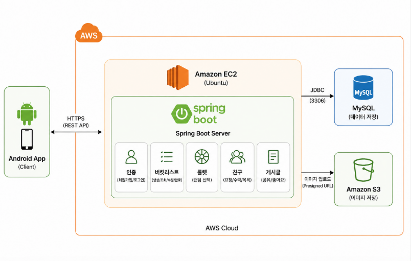

# Youth Spin


Youth Spin(유스핀)은 버킷리스트를 등록하고 룰렛으로 하나를 뽑아 도전한 뒤, 완료 인증글을 친구 피드에 공유하는 서비스입니다.

사용자는 버킷을 등록하고 룰렛으로 도전할 버킷을 선택합니다. 도전을 완료하면 인증글을 작성할 수 있고, 공개로 설정한 인증글은 친구 피드에 노출됩니다.

## 기술 스택

| 구분 | 기술 |
| --- | --- |
| Language | Java 17 |
| Framework | Spring Boot 4.1.0 |
| Persistence | Spring Data JPA, MySQL |
| Security | Spring Security, JWT |
| Image Storage | AWS S3 (Presigned URL) |
| Infra | AWS EC2, RDS |
| Docs | springdoc-openapi (Swagger UI) |
| Build | Gradle |

## 서버 아키텍처



```
Client → JWT Filter → Controller → Service → Repository → MySQL(RDS)
 
이미지 업로드:
Client → POST /api/images/presigned-url → S3 Presigned URL 발급
Client → S3로 직접 PUT 업로드
Client → POST /api/posts/{bucketId} (imageUrl 포함)
```

## 패키지 구조

```
com.youthroulette.server
├── auth       # 회원가입, 로그인
├── bucket     # 버킷 등록, 룰렛, 도전 상태 관리
├── common     # 공통 예외, 에러 응답
├── config     # AWS 설정
├── friend     # 친구 요청, 친구 목록
├── image      # S3 Presigned URL 발급
├── post       # 인증글, 좋아요, 친구 태그
├── security   # JWT, Spring Security 설정
└── user       # 내 정보, 닉네임, 프로필 수정
```

## 핵심 도메인 규칙

- 미완료(`TODO`+`IN_PROGRESS`) 버킷은 최대 8개까지 등록 가능. `COMPLETED` 버킷은 개수 제한과 무관
- 룰렛은 `TODO` 상태 버킷만 대상으로 하며, `IN_PROGRESS` 버킷이 하나라도 있으면 돌릴 수 없음
- 버킷 상태: `TODO` → `IN_PROGRESS`(도전 시작) → `COMPLETED`(완료 처리)
- `COMPLETED` 상태 버킷만 인증글 작성 가능
- 인증글의 `visibility`가 `PUBLIC`이면 친구 피드에 노출, `PRIVATE`이면 본인만 조회
- 인증글에는 이미 수락된 친구(`friends`, `ACCEPTED`)만 태그 가능
## API 명세서

📄 [API 명세서 - Notion 링크](https://app.notion.com/p/API-71a9418778cb8338a437010398222ade)

## ERD

📄 [ERD - Notion 링크](https://app.notion.com/p/ERD-ace9418778cb82409c68817c3972f58a)

## 실행 방법

### 로컬 개발 실행

```bash
# 1. DB 생성
CREATE DATABASE bucketroulette CHARACTER SET utf8mb4 COLLATE utf8mb4_unicode_ci;
 
# 2. 환경 변수
DB_URL=jdbc:mysql://localhost:3306/bucketroulette?serverTimezone=Asia/Seoul&characterEncoding=UTF-8
DB_USERNAME=root
DB_PASSWORD=1234
JWT_SECRET=your-jwt-secret
AWS_ACCESS_KEY=your-access-key
AWS_SECRET_KEY=your-secret-key
S3_BUCKET_NAME=your-s3-bucket
 
# 3. 실행
./gradlew bootRun
```
기본 포트는 8080이며, `/swagger-ui/index.html`에서 API 문서를 확인할 수 있습니다.

### 배포 (AWS EC2 + RDS)

**인프라 구성**
- **RDS**: MySQL 8.0, 프리티어. 보안그룹 인바운드는 EC2 보안그룹에서 오는 3306 요청만 허용
- **EC2**: Amazon Linux 2023, t3.micro. 보안그룹은 22(SSH, 내 IP만)/8080(API, 전체 허용)만 개방
- **S3**: Presigned URL 방식 이미지 업로드. 버킷에 PUT/GET 허용하는 CORS 설정 필요
  
**1. RDS에 빈 스키마 생성**
```sql
CREATE DATABASE bucketroulette CHARACTER SET utf8mb4;
```

**2. EC2에 Java 17 설치**
```bash
sudo yum install -y java-17-amazon-corretto
```

**3. 로컬에서 빌드 후 EC2로 전송**
```bash
./gradlew clean build -x test
scp -i {key.pem} build/libs/{jar파일명} ec2-user@{EC2_퍼블릭_IP}:/home/ec2-user/app.jar
```

**4. 환경 변수 파일 작성** (`/etc/bucketroulette/env`)
```
DB_URL=jdbc:mysql://{RDS_엔드포인트}:3306/bucketroulette?serverTimezone=Asia/Seoul&characterEncoding=UTF-8
DB_USERNAME=admin
DB_PASSWORD={RDS_비밀번호}
JWT_SECRET={32자_이상_시크릿}
AWS_ACCESS_KEY={S3_액세스키}
AWS_SECRET_KEY={S3_시크릿키}
S3_BUCKET_NAME={버킷이름}
```

**5. systemd 서비스 등록** (`/etc/systemd/system/bucketroulette.service`) — SSH 세션이 끊겨도 계속 실행되고, 죽으면 자동 재시작됨
```ini
[Unit]
Description=Bucket Roulette Spring Boot App
After=network.target
 
[Service]
User=ec2-user
EnvironmentFile=/etc/bucketroulette/env
ExecStart=/usr/bin/java -jar /home/ec2-user/app.jar
Restart=always
RestartSec=10
 
[Install]
WantedBy=multi-user.target
```
```bash
sudo systemctl daemon-reload
sudo systemctl enable bucketroulette   # 재부팅 시 자동 시작
sudo systemctl start bucketroulette
sudo systemctl status bucketroulette   # Active: active (running) 확인
```

**6. 재배포할 때마다**
```bash
./gradlew clean build -x test
scp -i {key.pem} build/libs/{jar파일명} ec2-user@{EC2_퍼블릭_IP}:/home/ec2-user/app.jar
```
```bash
sudo systemctl restart bucketroulette
```

**로그 확인**
```bash
sudo journalctl -u bucketroulette -f
```

## 인증 방식

로그인 성공 시 `{ "accessToken": "...", "tokenType": "Bearer" }`를 반환합니다. 이후 요청에는 `Authorization: Bearer {accessToken}` 헤더가 필요합니다.

## 에러 응답 형식

```json
{
  "code": "VALIDATION_ERROR",
  "message": "요청 값이 올바르지 않습니다.",
  "status": 400,
  "errors": [
    { "field": "title", "reason": "버킷 제목은 1~100자여야 합니다." }
  ]
}
```
`code`는 `LOGINID_DUPLICATED`, `BUCKET_NOT_FOUND`, `ALREADY_IN_PROGRESS` 등 상황별로 세분화되어 있어 프론트가 코드 값만으로 분기할 수 있습니다.

## 고민했던 부분

**룰렛 도전 상태 제한** : 여러 버킷에 동시에 도전하면 상태 관리가 복잡해져서, `IN_PROGRESS` 버킷이 하나라도 있으면 룰렛을 막았습니다. 덕분에 사용자는 항상 하나의 도전에만 집중하게 됩니다.

**버킷 8개 제한의 기준** : 처음엔 전체 버킷 개수로 제한했는데, 그러면 완료한 버킷이 쌓일수록 새 버킷을 못 만드는 문제가 있었습니다. `IN_PROGRESS`와 `COMPLETED`를 제외하고 미완료(`TODO`) 버킷 기준으로만 세도록 수정했습니다.

**인증글 작성 시점 제한** : 도전 완료를 증명하는 기능이라 `COMPLETED` 상태 버킷에서만 작성 가능하도록 막았습니다. 완료 처리와 인증글 작성을 분리해서, "완료했지만 아직 인증 안 한 버킷"과 "인증까지 끝낸 버킷"을 구분할 수 있게 했습니다.

**에러 코드 세분화** : HTTP status와 message만으로는 같은 409라도 아이디 중복인지, 이미 도전 중인지, 이미 좋아요를 눌렀는지 프론트가 구분하기 어려웠습니다. `ErrorCode` enum으로 코드를 세분화해서 프론트가 `code` 값만으로 안정적으로 분기하도록 했습니다.

**이미지 업로드 방식** : 서버가 이미지를 직접 받으면 부하와 구현 복잡도가 늘어서, Presigned URL 방식을 택했습니다. 서버는 업로드 권한이 담긴 URL만 발급하고 클라이언트가 S3에 직접 업로드하며, 인증글에는 최종 `imageUrl`만 저장해 게시글 도메인과 이미지 저장소를 느슨하게 연결했습니다.

**친구 태그 모델링** : 유저 ID를 직접 저장하는 대신 이미 수락된 친구 관계(`friends`)를 참조하도록 설계해서, 친구가 아닌 사람을 태그하는 걸 구조적으로 막았습니다.

**삭제 정책** : 버킷·인증글은 연관 데이터가 많아 JPA cascade와 orphan removal로 정리되도록 했습니다. 다만 완료된 버킷을 삭제하면 인증글도 함께 사라지므로, 삭제 API를 호출하는 쪽에서 주의가 필요합니다.

**`@PathVariable` 500 에러 (`-parameters` 컴파일 옵션)** : 배포 후 `@RequestParam`/`@PathVariable`에 이름을 명시하지 않은 API에서 `IllegalArgumentException`이 발생했습니다. Java는 컴파일 시 기본적으로 메서드 파라미터 이름 정보를 버리는데, Spring이 리플렉션으로 그 이름을 읽어오지 못해 생긴 문제였습니다. `build.gradle`에 `-parameters` 컴파일 옵션을 추가해 해결했습니다.

 